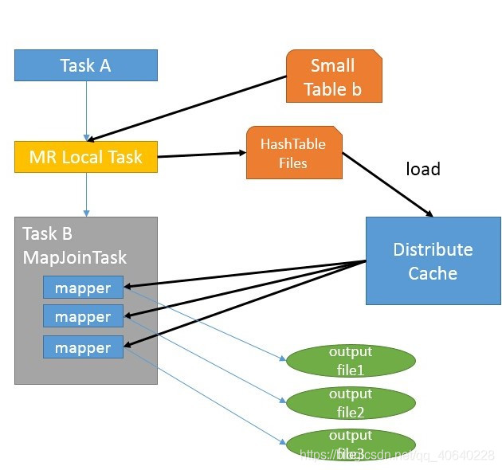

# 常见面试问题方向

## 1. 核心组件的优化：Hive、Spark、Flink

### 1.1 Hive的优化

#### 1、Fetch抓取

  Fetch抓取是指，Hive中对某些情况的查询可以不必使用MapReduce计算。例如：SELECT * FROM employees;在这种情况下，Hive可以简单地读取employee对应的存储目录下的文件，然后输出查询结果到控制台。

  在hive-default.xml.template文件中hive.fetch.task.conversion默认是more，老版本hive默认是minimal，该属性修改为more以后，在全局查找、字段查找、limit查找等都不走mapreduce。

#### 2、本地模式

  大多数的Hadoop Job是需要Hadoop提供的完整的可扩展性来处理大数据集的。不过，有时Hive的输入数据量是非常小的。在这种情况下，为查询触发执行任务时消耗可能会比实际job的执行时间要多的多。对于大多数这种情况，Hive可以通过本地模式在单台机器上处理所有的任务。对于小数据集，执行时间可以明显被缩短。

  用户可以通过设置hive.exec.mode.local.auto的值为true，来让Hive在适当的时候自动启动这个优化。

  (1)set hive.exec.mode.local.auto=true; //开启本地mr

  //设置local mr的最大输入数据量，当输入数据量小于这个值时采用local mr的方式，默认为134217728，即128M   (2)set hive.exec.mode.local.auto.inputbytes.max=50000000;

  //设置local mr的最大输入文件个数，当输入文件个数小于这个值时采用local mr的方式，默认为4   (3)set hive.exec.mode.local.auto.input.files.max=10;

#### 3、过滤导致数据倾斜的Key、空Key转换(数据倾斜)

  有时join超时是因为某些key对应的数据太多，而相同key对应的数据都会发送到相同的reducer上，从而导致内存不够。此时我们应该仔细分析这些异常的key，很多情况下，这些key对应的数据是异常数据，我们需要在SQL语句中进行过滤。

  有时虽然某个key为空对应的数据很多，但是相应的数据不是异常数据，必须要包含在join的结果中，此时我们可以表a中key为空的字段赋一个随机的值，使得数据随机均匀地分不到不同的reducer上。

#### 4、设置MapJoin(数据倾斜)

  如果不指定MapJoin或者不符合MapJoin的条件，那么Hive解析器会将Join操作转换成Common Join，即：在Reduce阶段完成join。容易发生数据倾斜。可以用MapJoin把小表全部加载到内存在map端进行join，避免reducer处理。

 **1）开启MapJoin参数设置：**   （1）设置自动选择Mapjoin     set hive.auto.convert.join = true; 默认为true   （2）大表小表的阀值设置（默认25M一下认为是小表）：     set hive.mapjoin.smalltable.filesize=25000000;

 **2）MapJoin工作机制**



首先是Task A，它是一个Local Task（在客户端本地执行的Task），负责扫描小表b的数据，将其转换成一个HashTable的数据结构，并写入本地的文件中，之后将该文件加载到DistributeCache中。   接下来是Task B，该任务是一个没有Reduce的MR，启动MapTasks扫描大表a,在Map阶段，根据a的每一条记录去和DistributeCache中b表对应的HashTable关联，并直接输出结果。   由于MapJoin没有Reduce，所以由Map直接输出结果文件，有多少个Map Task，就有多少个结果文件。

#### 5、针对Group By优化，开启Map端聚合

  默认情况下，Map阶段同一Key数据分发给一个reduce，当一个key数据过大时就倾斜了。并不是所有的聚合操作都需要在Reduce端完成，很多聚合操作都可以先在Map端进行部分聚合，最后在Reduce端得出最终结果。    开启Map端聚合参数设置    （1）是否在Map端进行聚合，默认为True     hive.map.aggr = true   （2）在Map端进行聚合操作的条目数目      hive.groupby.mapaggr.checkinterval = 100000   （3）有数据倾斜的时候进行[负载均衡](https://cloud.tencent.com/product/clb?from_column=20065&from=20065)（默认是false）      hive.groupby.skewindata = true

#### 6、Count(Distinct) 去重优化方案(数据倾斜)

  数据量小的时候无所谓，数据量大的情况下，由于COUNT DISTINCT操作需要用一个Reduce Task来完成，这一个Reduce需要处理的数据量太大，就会导致整个Job很难完成，一般COUNT DISTINCT使用先GROUP BY再COUNT的方式替换，虽然会多用一个Job来完成，但在数据量大的情况下，这个绝对是值得的。

  select count(distinct id) from bigtable;(优化前)

  select count(id) from (select id from bigtable group by id) a;(优化后)

#### 7、迪卡尔基

  尽量避免笛卡尔积，join的时候不加on条件，或者无效的on条件，Hive只能使用1个reducer来完成笛卡尔积。

#### 8、行列过滤

  列处理：在SELECT中，只拿需要的列，如果有，尽量使用分区过滤，少用SELECT *。

  行处理：在分区剪裁中，当使用外关联时，如果将副表的过滤条件写在Where后面，那么就会先全表关联，之后再过滤。

#### 9、开启动态分区

  [关系型数据库](https://cloud.tencent.com/product/cdb-overview?from_column=20065&from=20065)中，对分区表Insert数据时候，[数据库](https://cloud.tencent.com/solution/database?from_column=20065&from=20065)自动会根据分区字段的值，将数据插入到相应的分区中，Hive中也提供了类似的机制，即动态分区(Dynamic Partition)，只不过，使用Hive的动态分区，需要进行相应的配置。

  （1）开启动态分区功能（默认true，开启）     hive.exec.dynamic.partition=true

  （2）设置为非严格模式（动态分区的模式，默认strict，表示必须指定至少一个分区为静态分区，nonstrict模式表示允许所有的分区字段都可以使用动态分区。）     hive.exec.dynamic.partition.mode=nonstrict

  （3）在所有执行MR的节点上，最大一共可以创建多少个动态分区。     hive.exec.max.dynamic.partitions=1000

  （4）在每个执行MR的节点上，最大可以创建多少个动态分区。该参数需要根据实际的数据来设定。比如：源数据中包含了一年的数据，即day字段有365个值，那么该参数就需要设置成大于365，如果使用默认值100，则会报错。     hive.exec.max.dynamic.partitions.pernode=100

  （5）整个MR Job中，最大可以创建多少个HDFS文件。     hive.exec.max.created.files=100000

  （6）当有空分区生成时，是否抛出异常。一般不需要设置。     hive.error.on.empty.partition=false

#### 10、开启并行执行

  Hive会将一个查询转化成一个或者多个阶段。这样的阶段可以是MapReduce阶段、抽样阶段、合并阶段、limit阶段。或者Hive执行过程中可能需要的其他阶段。默认情况下，Hive一次只会执行一个阶段。不过，某个特定的job可能包含众多的阶段，而这些阶段可能并非完全互相依赖的，也就是说有些阶段是可以并行执行的，这样可能使得整个job的执行时间缩短。不过，如果有更多的阶段可以并行执行，那么job可能就越快完成。

  通过设置参数hive.exec.parallel值为true，就可以开启并发执行。不过，在共享集群中，需要注意下，如果job中并行阶段增多，那么集群利用率就会增加。   set hive.exec.parallel=true; //打开任务并行执行   set hive.exec.parallel.thread.number=16; //同一个sql允许最大并行度，默认为8。

  当然，得是在系统资源比较空闲的时候才有优势，否则，没资源，并行也起不来。

#### 11、开启严格模式

  Hive提供了一个严格模式，可以防止用户执行那些可能意向不到的不好的影响的查询。通过设置属性hive.mapred.mode值为默认是非严格模式nonstrict 。开启严格模式需要修改hive.mapred.mode值为strict，开启严格模式可以禁止3种类型的查询。

  1）对于分区表，除非where语句中含有分区字段过滤条件来限制范围，否则不允许执行。换句话说，就是用户不允许扫描所有分区。进行这个限制的原因是，通常分区表都拥有非常大的数据集，而且数据增加迅速。没有进行分区限制的查询可能会消耗令人不可接受的巨大资源来处理这个表。

  2）对于使用了order by语句的查询，要求必须使用limit语句。因为order by为了执行排序过程会将所有的结果数据分发到同一个Reducer中进行处理，强制要求用户增加这个LIMIT语句可以防止Reducer额外执行很长一段时间。

  3）限制笛卡尔积的查询。对关系型数据库非常了解的用户可能期望在执行JOIN查询的时候不使用ON语句而是使用where语句，这样关系数据库的执行优化器就可以高效地将WHERE语句转化成那个ON语句。不幸的是，Hive并不会执行这种优化，因此，如果表足够大，那么这个查询就会出现不可控的情况。

#### 12、开启JVM重用

  JVM重用是Hadoop调优参数的内容，其对Hive的性能具有非常大的影响，特别是对于很难避免小文件的场景或task特别多的场景，这类场景大多数执行时间都很短。

  Hadoop的默认配置通常是使用派生JVM来执行map和Reduce任务的。这时JVM的启动过程可能会造成相当大的开销，尤其是执行的job包含有成百上千task任务的情况。JVM重用可以使得JVM实例在同一个job中重新使用N次。N的值可以在Hadoop的mapred-site.xml文件中进行配置。通常在10-20之间，具体多少需要根据具体业务场景测试得出。

```linux
mapreduce.job.jvm.numtasks
10
How many tasks to run per jvm. If set to -1, there is no limit.
```

这个功能的缺点是，开启JVM重用将一直占用使用到的task插槽，以便进行重用，直到任务完成后才能释放。如果某个“不平衡的”job中有某几个reduce task执行的时间要比其他Reduce task消耗的时间多的多的话，那么保留的插槽就会一直空闲着却无法被其他的job使用，直到所有的task都结束了才会释放。

#### 13、开启推测执行机制

  在分布式集群环境下，因为程序Bug（包括Hadoop本身的bug），负载不均衡或者资源分布不均等原因，会造成同一个作业的多个任务之间运行速度不一致，有些任务的运行速度可能明显慢于其他任务（比如一个作业的某个任务进度只有50%，而其他所有任务已经运行完毕），则这些任务会拖慢作业的整体执行进度。为了避免这种情况发生，Hadoop采用了推测执行（Speculative Execution）机制，它根据一定的法则推测出“拖后腿”的任务，并为这样的任务启动一个备份任务，让该任务与原始任务同时处理同一份数据，并最终选用最先成功运行完成任务的计算结果作为最终结果。

  设置开启推测执行参数：Hadoop的mapred-site.xml文件中进行配置：

```java
mapreduce.map.speculative
true
If true, then multiple instances of some map tasks  may be executed in parallel.
	

	
mapreduce.reduce.speculative
true
If true, then multiple instances of some reduce tasks  may be executed in parallel.
```

不过hive本身也提供了配置项来控制reduce-side的推测执行：

```java
hive.mapred.reduce.tasks.speculative.execution
true
Whether speculative execution for reducers should be turned on. 
```

关于调优这些推测执行变量，还很难给一个具体的建议。如果用户对于运行时的偏差非常敏感的话，那么可以将这些功能关闭掉。如果用户因为输入数据量很大而需要执行长时间的map或者Reduce task的话，那么启动推测执行造成的浪费是非常巨大大。

#### 14、执行计划分析

  1）基本语法     EXPLAIN [EXTENDED | DEPENDENCY | AUTHORIZATION] query   2）案例实操     （1）查看下面这条语句的执行计划       hive (default)> explain select * from emp;       hive (default)> explain select deptno, avg(sal) avg_sal from emp group by deptno;     （2）查看详细执行计划       hive (default)> explain extended select * from emp;       hive (default)> explain extended select deptno, avg(sal) avg_sal from emp group by deptno;

#### 15、改变压缩格式

Snappy

#### 16、开启负载均衡机制(数据倾斜)

```java
hive.map.aggr=true
//Map 端部分聚合，相当于Combiner
hive.groupby.skewindata=true
```

​		有数据倾斜的时候进行负载均衡，当选项设定为 true，生成的查询计划会有两个 MR Job。第一个 MR Job 中，Map 的输出结果集合会随机分布到 Reduce 中，每个 Reduce 做部分聚合操作，并输出结果，这样处理的结果是相同的 Group By Key 有可能被分发到不同的 Reduce 中，从而达到负载均衡的目的；第二个 MR Job 再根据预处理的数据结果按照 Group By Key 分布到 Reduce 中（这个过程可以保证相同的 Group By Key 被分布到同一个 Reduce 中），最后完成最终的聚合操作。

#### 17、使用TEZ引擎

  开启TEZ引擎会将多个并行任务合并为一个任务执行，减少任务启停时间，提高运算效率。

#### 18、使用Combine(数据倾斜)

  使用Combine可以大量地减小数据频率倾斜和数据大小倾斜。在可能的情况下，combine的目的就是聚合并精简数据。

#### 19、抽样和范围分区(数据倾斜)

  可以通过对原始数据进行抽样得到的结果集来预设分区边界值。

#### 20、自定义分区(数据倾斜)

  基于输出键的背景知识进行自定义分区。例如，如果map输出键的单词来源于一本书。其中大部分必然是省略词（stopword）。那么就可以将自定义分区将这部分省略词发送给固定的一部分reduce实例。而将其他的都发送给剩余的reduce实例。

#### 21、为倾斜Key打上随机数(数据倾斜)

  把导致倾斜的key变成一个字符串加上随机数，把倾斜的数据分到不同的reduce上，由于null 值关联不上，处理后并不影响最终结果。


