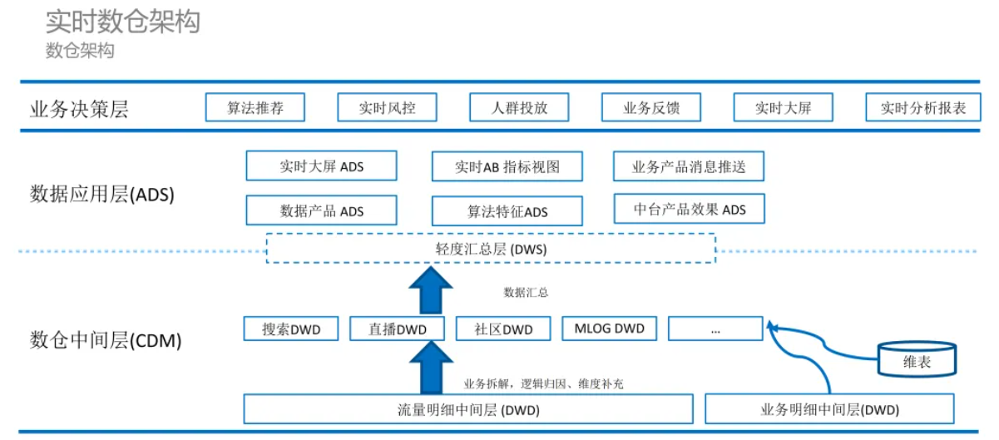
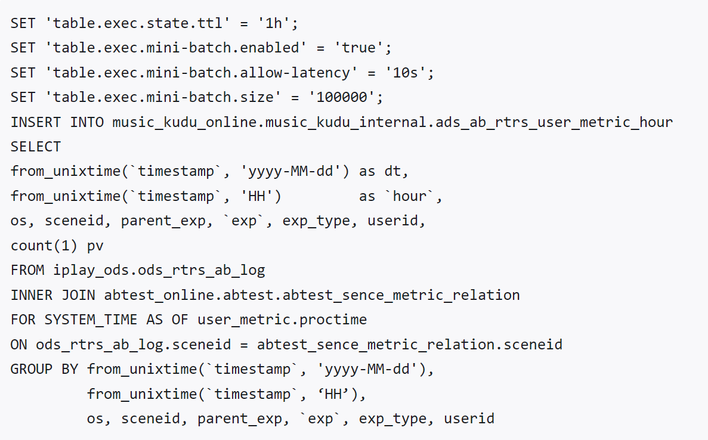
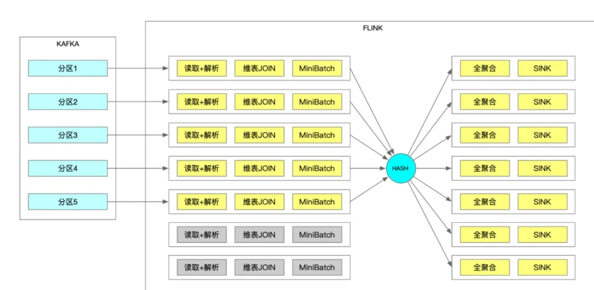
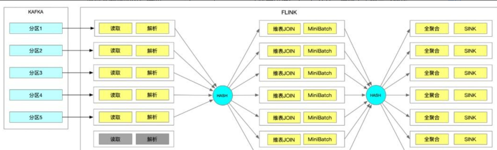
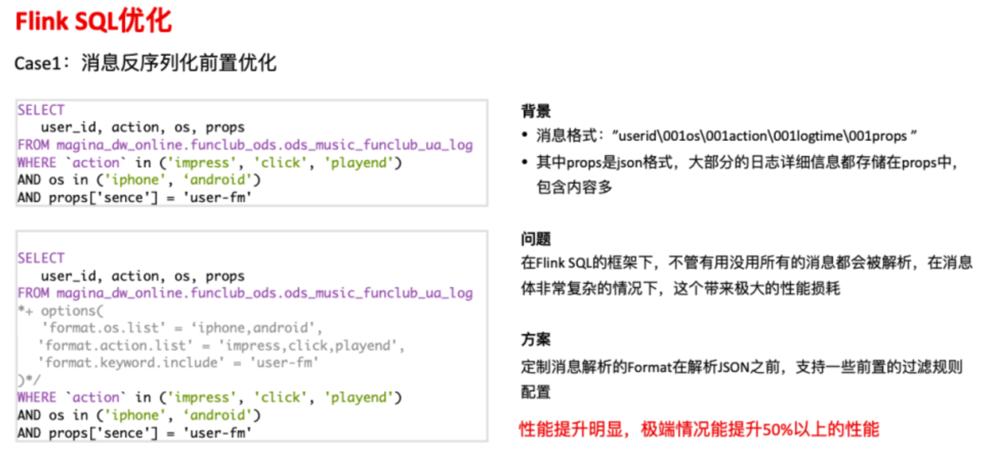
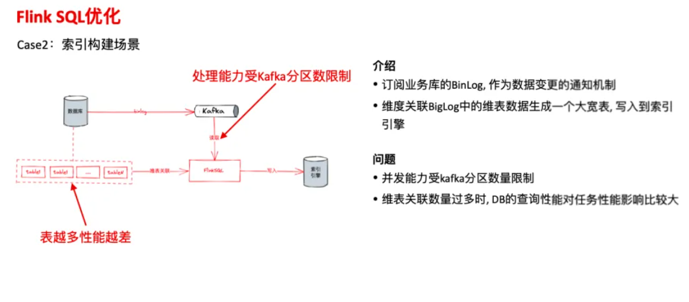

# 项目草稿模板

## 项目基本介绍

### 项目所应用的业务领域

酷我音乐

### 项目的面向群体（公司内部还是客户）

客户

### 做这个项目的主要目的

数仓平台的建设思路是希望成为连接技术和业务的桥梁，整合技术和业务，通过平台让数据被更高效地用起来。我们的定位是酷我音乐这个垂直业务的数据平台团队，需求方更多是音乐内部的需求，并不是通用的集团需求，因此与集团平台或者通用云服务上数据平台相比，我们更贴近业务，工具也更业务化。不同于普适的数据开发平台更倾向于开放通用能力，不会根据业务的流程规范做定制，我们需要根据内部的规范和需求定制化平台能力，需要深入到业务当中去，了解业务的需求和开发的痛点，提供整套的解决方案，同时我们也更关心业务方的成本，希望整体的使用更加经济。

## 项目架构介绍

### 离线项目架构

2022-09~2023-06                           酷我音乐离线数仓建设与优化系统                       大数据开发工程师

需求背景：酷我音乐盒是一款融歌曲和MV搜索、在线播放、同步歌词为一体的音乐聚合播放器，目前已经上限使用超过18年的时间，本系统是通过采集客户播放量、客户浏览量与评论等操作数据到后台的离线数仓，经过分析可视化展示，从而可以为改进流程、控制成本、提高推荐算法质量、精准广告投放等业务提供支撑。

主要工作内容：通过APP获取用户行为数据，结合业务数据，二者结合作为数仓数据源，通过sqoop拉取mysql中的业务数据，通过flume消费kafka中的数据存到hive，作为ods原始数据层，dwd作为清洗与轻度聚合，dwm层作为业务域分不同的产品线输出对应的报表，dws层作为宽表不断迭代拓宽数据指标。除此之外我还需要对数仓离线计算任务进行维护和优化，通过邮件的方式监控任务完成情况，并采用cdh管理集群，包括维护和调优等工作。

### 实时项目架构

2023-06~2024-01                            酷我音乐实时数仓建设与优化系统                        大数据开发工程师

现状

酷我音乐是国内首创的多种音乐资源聚合的播放软件，自2006年上线后已经使用了超过15年的时间，随着使用人数的增加，很多业务都离不开大数据处理。2023年开始，公司启动实时数仓开发业务线，一些典型的业务类型包括索引构建、特征开发、内容监控，以及报表、线上统计等。目前平台上实时任务有300+，离线任务在1400-1500之间，80%以上任务都是SQL任务，整个音乐软件的集群规模，纯计算节点大概有150+台机器，每天原始日志量十亿。

需求背景

第一，最近两年各大公司都在降本增效，有外部压力来推动资源优化治理。

第二，目前业务流量较大，kafka水位居高不下，长期位于70%-80%，如果突然出现一个偶然事件，或者一个知名歌星发布了新歌，会导致流量达到波峰，这样会使kafka抖动，对下游一系列任务产生影响。

第三：音乐平台内部最近上线了新的埋点体系，增加了很多额外的业务信息，与此同时带来了更多的流量增长，导致kafka集群和下游Flink任务压力非常大，对平台的稳定性是一个比较大的考验。


## 项目内容介绍

### 数据来源

接收来自日志服务器和业务服务器的原始流量数据以及业务数据库的 binlog 日志，作为实时数仓中间层的输入。

### 数据量

活跃用户数：240w

每个用户平均每天使用时长：2.5小时

用户行为：播放、点赞、收藏、评论、点击广告等

日志条数：一个用户约30条

每条日志大小：约10KB

dws和ads层增量膨胀倍率：约3倍

每天增量行为日志量：2400000 * 30 * 10k * 3 *3≈ 6亿KB≈5.4TB

压缩后大小：500G左右

单kafka峰值QPS：40w + 

在线运行任务数：300+

需要硬盘数量：一般情况下我们都会设置**3个副本，**另外 kafka 数据是有保留时间周期的, 一般情况是保留**最近7天的数据，**即 **5.4T \* 3 *7 = 113T。**

公司服务器：戴尔服务器  

CPU：双路AMD EPIC 9754 128核256线程（23年年底新换的机房架构，提高制程工艺，为了节省电费，减少企业TCO）

主板：AMD Titanite SP5 2P2U双路主板

内存：24通道 DDR5 4800 64GB ≈ 1.5T

硬盘： 镁光9300系列企业级NVMe SSD  15.36TB*12 ≈ 180TB

### 数据处理主要使用哪些框架

技术框架：kafka、flink、redis、hbase、mysql、kudu、clickhouse

### 数据存储展示方式

包括实时大屏ADS、实时AB指标视图、业务产品消息推送、数据产品ADS、算法特征ADS、中台产品效果ADS

### 项目的维护

#### 数据质量如何保证？

对于大屏类和业务算法类的数据质量，由于这部分场景对于更新频率、延时性要求极高。比如实时大屏要求看到秒级的数据变动、算法团队要求看到 5 分钟级别的用户特征更新。这类场景基本无法通过准实时链路来实现。因此这类场景的需求会通过 Flink 进行增量或全量计算，将结果数据写入 Redis、HBase 或 MySQL 等可以直接查询的业务数据源中。这类任务基本上都是优先级较高的实时任务，需要重点保障。因此还需要进行全链路多备份，防止由于集群问题对大屏数据或者业务数据产生影响。这类任务的消耗和异常的修复成本都是非常高的，所以需要尽量保证其高可用。

#### 数据出了问题如何快速处理的？

在运行的过程中我们有一个分发的服务，在分发的过程中我们会根据一定的规则来检测哪些数据是异常的，哪些是正常的，然后将异常的数据单独分发到一个异常的 Topic 中去做查询等，后期在使用的过程中可以根据相关指标和关键词到异常的 Topic 中去查看这些数据。

## 在项目中主要负责什么

### 数据采集

我们的数据采集主要是四个来源，包括主站APP客户端日志、服务端日志、业务流量日志、业务binLog日志。其中行为埋点数据是由Flume从Nginx集群中采集的，业务数据是由Canal从Mysql服务器集群中采集的，采集的数据保存到消息中间件Kafka中。

### 数据清洗

数据清洗这边我们用的是机器学习、深度学习、自然语言处理等技术，我们是算法组通过训练模型自动识别和清洗数据中的异常值、重复值、无用信息等，提高数据的质量和可用性。他们还通过构建深度神经网络模型，对数据进行逐层抽象和模拟，实现更加复杂和高效的数据清洗任务。

### 维度建模



### 指标计算

#### 负责的指标数据哪些主题域

包括用户主题、歌单主题、歌曲主题、流量主题、直播间主题等。

#### 具体计算了哪些指标

实时统计在线听歌人数、实时统计每个歌手的听歌人数、实时统计热门歌曲TopN、实时统计歌曲热评，实时统计用户喜好的歌曲类型、实时统计直播间在线人数等。

#### 用到哪些表

用户表：tb_user (用户ID，用户设备id，用户设备类型，用户所在地IP，事件类型，网络类型，下载渠道，时间戳等)

**歌曲主表**：tb_music （歌曲ID、歌手ID、歌曲状态、歌曲播放量等）

**歌曲明细表**：tb_music_goods（歌曲主表ID、分类ID、时长、歌手ID、歌曲状态、歌曲播放量、歌曲类型、发布时间等）

主播房间表: tb_live_room（直播间ID、**主播ID**）

主播表: tb_live_anchor (主播ID)


#### 用到哪些表字段（字段：示例）

​	"carrier":"中国电信",
​    "deviceId":"aff486e2-1942-45ae-8623-9d6ef1f29b2f",
​    "deviceType":"IPHONE-7PLUS",
​    "eventId":"appLaunch",
​    "id":79,
​    "isNew":1,
​    "latitude":37.942441944941706,
​    "longitude":115.21183014458548,
​    "netType":"WIFI",
​    "osName":"ios",
​    "osVersion":"8.2",
​    "releaseChannel":"AppStore",
​    "resolution":"2048*1024",
​    "sessionId":"fqKovEGyuNM0",
​    "timestamp":1615814321410

### 任务调度

首先要进行任务解耦：一个任务流产出一张正式表，任务名即表名，任务按业务归属、表分层部署在对应大数据平台目录下。

之后对于任务节点有以下要求：

- 开始节点：任务入口，虚拟节点，建议命名：start。
- 结束节点：任务终点，虚拟节点，大数据平台默认以任务名为结束节点。
- 说明节点：任务注释文档说明用， 数据平台无文档节点，建议使用SQL节点注释语法实现，命名readme。
- 依赖节点：表依赖节点，MR节点，以while循环check表数据文件时间戳形式检测表是否ready。建议命名：dep-表名［-分区名］
- 计算节点：临时表或正式表产出节点，SQL节点。建议命名：［insert-］表名［-分区名］
- 依赖配置： 大数据平台 支持线上模式编辑调度配置任务依赖、节点依赖，任务或节点需同属于大数据平台 任务，暂不支持配置Pandora任务依赖。也可使用任务内MR节点方式配置依赖。两种方式各有优劣，按需配置，不做要求。
- 临时表：任务逻辑较为复杂或需要复用中间结果时，考虑使用临时表或视图表。因磁盘读写速度远低于内存读写，故应多使用内存表，尽量减少临时表落盘。但是，当不得不做一件有代价的事情的时候，应考虑最大化利用其价值。

​		我们整体的能力构建于集群服务之上，集群服务提供了通用的数据处理和治理的能力，比如实时任务开发平台sloth，基于Flink，提供了通用的实时数据处理能力，支持SQL处理实时数据；元数据中心提供了通用的数仓元数据管理能力，血缘追踪能力；安全中心，基于Ranger提供了通用的权限管理的基础能力。在集群提供的完善的基础能力之上，我们根据音乐内部的规范以及需求做了封装和定制，把业务规范做到平台上、整合最佳实践，让用户以更低的门槛和成本，以更高的效率和质量在平台上完成业务需求数据处理工作。

### 可视化展示

​		使用企业内部的BI分析平台，进行可视化大屏展示。

### 集群监控

​		监控工具我们用的是Grafana，通过自定义仪表盘，将数据以图表、图形、表格等多种方式进行可视化展示，并利用其强大的告警功能，设置阈值并创建告警规则。我们主要有资源监控、流量埋点监控、恶意刷评监控、AB效果监控等。当指标超出设定的范围时，系统会触发告警通知，通过电子邮件、Slack、钉钉等途径通知我们。


## 开发过程中遇到过哪些问题

### 集群环境问题

我们遇到了Kafka 分区问题

Kafka 分区的限制也是经常导致我们程序性能无法扩展的原因，出于 Exactly Once 的实现、读取性能、以及读取稳定性的考虑，Flink 采用主动拉取的方式读取 Kafka 消息，这种方式限制了我们读取 Kafka 消息的任务数，大大限制我们任务性能的扩张能力，以下面这个 case 为例：



这是一个实时全聚合任务，在原始的 FLINK 中这段 SQL 执行的 DAG 大概是这样的：



假如我们读取的流表 ods_rtrs_ab_log 有 5 个分区，我们的 SQL 任务有七个并发，因为受到 Kafka 分区数的影响，加上 FLINK 本身作业链的优化，我们的消息的读取、维表 JOIN、MINI BATCH 的操作全部受到了 Kafka 分区的影响，无法扩展，特别是对于维表 JOIN 这种 IO 操作来说，任务的并发度严重影响了整体程序的性能，这个时候我只能通过扩容 Kafka 的分区数来提升性能。

但是这种操作非常重，而且很有可能会影响其它读取这张流表的任务；为了解决这个问题，我们对 Kafka 的 Connector 做了一些改造，支持通过配置多添加一步 Shuffle 操作，比如在上面的配置当中我们添加了配置：

```text
'connector.rebalance.keys' = 'sceneid,parent_exp,userid'
```

消息会在读取以后按照 sceneid,parent_exp,userid 等字段进行 hash 分片，这样大大提高了整体程序的性能扩展性，而且通过指定字段的 keyBy 操作，可以大大提高维表 JOIN 缓存的命中率，提高 MINI BATCH 的性能和效率。



除了以上配置以外，我们还支持添加随机的 Rebalance 操作、Rescale 操作以及解析行为的拆解，来进一步提升整体程序性能的扩展，这里需要注意的是额外 Shuffle 操作，会带来更多线程和网络开销，在配置这些操作的同时需要同时关注机器的负载情况，添加额外的 Shuffle 操作虽然能提升程序的扩展性，但是由于额外网络和线程开销，如果机器本身性能不行的话，很有可能会适得其反，在相同的资源情况下性能变得更差，这点需要根据自己程序以及环境情况进行配置。

### 数据质量问题

##### 问题主要有三个方面：

1. 数据规范：因为早期数仓建设的时候迭代速度快，没有一个标准的设计模式，导致数据非常凌乱。
2. 数据生产：酷我音乐是个内容流量产品，目前在数据埋点这方面存在埋点定义混乱，埋点质量问题多，以及埋点信息不够全面等问题。埋点信息不够全面也导致我们无法支持要求越来越高的精细化运营场景。
3. 数据资产：大数据开发经常面临开发周期长、交付质量差的问题；另外计算和存储的成本迅速增长也是我们目前急需解决的问题。

接下来就针对上述三方面来展开介绍一下酷我音乐的数据治理工作。

Flink SQL大大降低了实时计算的开发门槛，提升了开发效率，但是它也带来了一些问题，SQL背后逻辑的不透明，让用户能够控制的东西也变少了，这导致了一些不必要的计算逻辑，同时用户能做的优化手段也变少了，这导致了中间有很多的资源浪费。下面通过一些我们遇到的情况来说明。

Case 1 : 消息反序列化前置优化



背景：日志消息格式为userid\001os\001action\001logtime\001props。Props 是 JSON格式，所以在读取流表的过程中大部分性能损耗都在JSON 的解析上。离线的场景下我们可以做列裁剪，只读需要的数据，但是在实时情况下，还没有那么成熟，不管我们需要不需要props这个字段，FlinkSQL本身都会对整条消息做解析，这导致了很多的资源浪费。

为了解决这个问题，我在反序列化上做了一些优化，用户可以通过一些配置在解析完整日志前做一些过滤，比如上图中的这两条SQL的对比，在解析整条消息之前，通过keyword配置做关键字过滤，将不包含‘user-fm’关键字的消息全部过滤掉，在解析props之前，通过os.list和action.list过滤掉多余的消息，通过这些配置可以减少大量无用消息的解析，大大提升整体任务的性能，降低CPU的消耗。这些优化在很多情况下效果非常明显，极端情况下能减少50% 以上的性能损耗。

与离线场景下的列裁剪类似，按需解析，按需反序列化，这个优化还可以持续优化，现在还需要用户手动去配置，我们最终的目标是根据用户的 Select 字段结合format的实现做自动的列裁剪优化。

Case 2 :索引构建场景



第二个case是索引构建场景。很多索引是通过关联多张数据库表，生成大宽表，写入到索引引擎里面的，然后提供给前端用户去查询。大致流程为，用户通过Flink订阅数据库的binlog日志来监听业务库的数据变化，然后把binlog里面关键数据和很多业务DB表进行关联，生成一个大宽表，最后再通过Flink写入到索引构建引擎里面，供用户查询。这里存在几个问题：

- 第一：Flink SQL读 Kafka受到Kafka 分区的限制，比如10个分区只能通过10个并发去读取和消费；
- 第二：当维表关联特别多的时候，因为上游的分区有限，下游维表关联受到维表查询性能的限制，表越多单条消息的处理性能越差。

两者结合就导致整体的处理性能无法做到水平扩展，无论怎样扩大Flink任务并发，始终也都只有10个并发在处理消息，导致任务的延迟非常严重。

我们的优化方案是：

- 第一：完善 Metrics 监控，把所有的维表关联的 Metrics，比如每张维表查询的RT，消息反序列化的性能、以及写入三方存储的RT 相关监控指标全部收集上来，写入到任务的监控里面去，在Granafa上展示出来，这样如果哪张维表因为索引设计不当，导致维表关联的性能特别差，就可以通过 Granafa的监控页面快速发现，并进行优化。
- 第二：针对维表越多性能越差的问题，添加异步关联配置，开启 Flink AyncIO的特性，通过异步关联的方式提升任务整体的处理能力。
- 第三：关于处理能力受Kafka分区限制的问题：Flink在读取Kafka消息时会自动做OperationChain的优化，会把读取动作、解析动作、维外关联写入动作全部绑定在一起，导致这一系列动作都会受到Kafka 的并发限制，整个处理能力非常糟糕。特别是在维表关联特别多的时候，即使开启异步优化，整体性能的提升也不是特别明显，这个时候需要一个能力把行为拆开，分别设置并发。所以在Flink SQL 里面加了一个配置，在读取表消息的过程中添加一个修改并发的操作，把读取消息行为和后续的解析处理消息的行为拆开。通过在中间加一个rescale或者rebalance的操作，分别设置读取和后续解析处理的并发。在没有按照消息内容shard的需求时，我们推荐 rescale，因为 rescale 的性能损耗比较小。这样后续维表关联的功能就可以不受Kafka分区数量的限制，可以通过调整后续处理的并发，做到处理能力水平扩展，当然中间添加rescale或者rebalance操作会导致消息乱序，在对消息顺序有要求的场景上时，这个优化不能使用。
- 最后，这种类型的任务都是IO密集型任务，输入流量往往都不是很大，加并发只是为了增加DB维表查询的并发，提升任务整体的吞吐。所以在优化这种类型时，我们还会优化CPU的配置，通过yarn.containers.vcors的配置，做细粒度CPU资源分配。默认情况下一个slot分配一个CPU，通过这个配置可以控制比例，比如4个Slot， yarn.containers.vcors 配置为2的话，一个Slot 就只分配到0.5个CPU,同时也能带来资源的节省。

### 极端环境问题

#### 数据倾斜

​		在平台初期， 最开始用于实时计算的只有两个集群，且有一个采集集群，单 Topic 数据量非常大；不同的实时任务都会消费同一个大数据量的 Topic，Kafka 集群 IO 压力异常大；

​		因此，在使用的过程发现 Kafka 的压力异常大，经常出现延迟、I/O 飙升、数据倾斜问题。

​		我们想到把大的 Topic 进行实时分发来解决上面的问题，基于 Flink 1.5 设计了如下图所示的数据分发的程序，也就是实时数仓的雏形。基于这种将大的 Topic 分发成小的 Topic 的方法，大大减轻了集群的压力，提升了性能，另外，最初使用的是静态的分发规则，后期需要添加规则的时候要进行任务的重启，对业务影响比较大，之后我们考虑了使用动态规则来完成数据分发的任务。

#### 数据堆积

​		在平台初期试用过程中，我们同样遇到了很多数据积压问题，最多的问题是很多任务已经没有在使用了，却仍然在集群中运行，导致任务堆积越来越多，我们会采取以下方式将无用任务下线：

- 通过血缘判断，如果输出数据没有任务消费，则大概率任务是无用任务。获取血缘的手段主要有两种，对于SQL任务和使用我们SDK开发的实时任务，会通过静态SQL解析获取任务的血缘信息，比较准确。对于Jar任务，通过日志解析抽取关键信息来获取血缘，这种方式就不一定能抓取全。所以对于血缘收集，我们内部一直倡导的是约定大于技术优化，推进用户改造使用SQL或者我们的SDK进行开发，来获取血缘，而非适配用户的开发习惯，浪费人力使用很奇怪的方式去抽取血缘。
- 运维积极性，如果任务长期无人运维管理，报警不处理，可以找用户确认是否还在使用。
- 根据业务周期判断，如果业务已经下线，比如日常活动已经下线，则可以推进相关任务下线。

#### 数据延迟

​		我们在平台开发中遇到了同交换机流量激增消费计算延迟问题，这个问题是最近才出现的问题，也可能不仅仅是同交换机，同机房的情况也可能。在同一个交换机下我们部署了很多机器，一部分机器部署了 Kafka 集群，还有一部分部署了 Hadoop 集群。在 Hadoop 上面我们可能会进行 Spark、Hive 的离线计算以及 Flink 的实时计算，Flink 也会消费 Kafka 进行实时计算。在运行的过程中我们发现某一个任务会出现整体延迟的情况，排查过后没有发现其他的异常，除了交换机在某一个时间点的浏览激增，进一步排查发现是离线计算的浏览激增，又因为同一个交换机的带宽限制，影响到了 Flink 的实时计算。

为解决这个问题，我们就考虑要避免离线集群和实时集群的相互影响，去做交换机部署或者机器部署的优化，比如离线集群单独使用一个交换机，Kafka 和 Flink 集群也单独使用一个交换机，从硬件层面保证两者之间不会相互影响。


